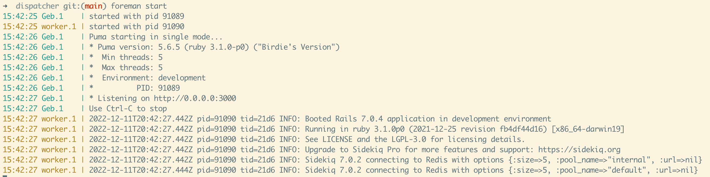

# Dispatcher

Take home assignment to create a proxy service for delivering sms messages to
two different providers. 

## Project Setup

This setup assumes you have postgres and redis installed. If not installed yet,
please install using your preferred method. For MacOS:

```
brew install postgresql
brew install redis
```

and then check that services are running correctly:
```
brew services list
```

If not running, you can start them with:
```
brew services start redis
brew services start postgresql
```

Versions I used for development:

```
redis 6.2.6
postgres 14.4
```

This project uses `ruby-3.1.0`. Please use your preferred ruby version manager
to install it. Older versions will likely work as well. 

Once postgres and redis are running, and you have ruby installed, you can run
the following to install dependencies and setup the database:

```
bundle install
bin/rails db:create
bin/rails db:migrate
```

You'll want to install foreman gem globally to leverage the procfile for
background jobs. Please make sure not to install it as a project dependency.
See [this wiki](https://github.com/ddollar/foreman/wiki/Don't-Bundle-Foreman)
for more details.

```
gem install foreman
```

Then you can start the both the web server and the background worker using:

```
foreman start
```

You should now see the web server and worker start up correctly as shown in the
screenshot below.



If working with or testing webhook/callback functionality, you'll need to set up
an ngrok account. Please follow these steps:

- Visit [ngrok.com](https://ngrok.com/), click signup and follow the
  instructions to signup for a free account
- Once you create an account, you'll be redirected to a
  [get started/setup page](https://dashboard.ngrok.com/get-started/setup)
- Click download for your OS and make sure to give ngrok permission to run on
  your system
- Move the executable under `/usr/local/bin` or update your PATH to include the
  ngrok path:
  e.g: `export PATH="$PATH:<REPLACE_WITH_NGROK_PATH>"`
- Don't forget to add
  [your authorization token](https://dashboard.ngrok.com/get-started/your-authtoken):
  ```
  ngrok config add-authtoken REPLACE_ME_WITH_YOUR_TOKEN
  ```

Once you have ngrok installed you should be able to tunnel requests to your
local application:

```
ngrok http 3000
```

If you have forman started, Control+C to stop it.  Run the following script to
grab the ngrok public url and set your `DISPATCH_NGROK_ENDPOINT` env var. Make
sure to run it in the terminal window where you will start foreman.

```
./scripts/get_ngrok_endpoint.rb
```

And now you're ready to start foreman again.

```
foreman start
```

Note that if you're testing callbacks from an external service and using the
free ngrok tier, the external service will need to:

> Set and send an ngrok-skip-browser-warning request header with any value.
> Or, set and send a custom/non-standard browser User-Agent request header.

Otherwise, a paid ngrok account is required. Ngrok does this to prevent abuse.

## A Brief Overview of Architectural Choices

_Note: Happy to discuss this further over zoom_

### Services

Services are used to slim down controllers. Logic is extracted and isolated in a
single location which makes it easy to maintain a single source of truth and
test business logic.

### Background Jobs

Background jobs are used to make the system more fault tolerant when interacting
with third party APIs and delegate computationally intensive work to worker
processes.

### Controllers

The MessagesController is meant to be simple and delegate responsibility to
services.  It handles parameter presence and captures errors in order to display
friendlier error messages.

### Models

There are two models defined: `Message` and `PhoneNumber`. They assist with
database interactions and provide some validation functionality. Not all
validations are performed via Rails validations; database constraints are
leveraged to maintain data integrity and prevent race conditions which rails
validations alone are not able to help with.

### Lib

The `provider_one` and `provider_two` clients are located under the lib dir.
These are simple modules that act as wrappers around Faraday http library. They
implement some convenience methods to initiate the third party requests and
return a BadGateway error, as a catch all, in case the third party is down.

Custom errors are also defined under lib.

### Some notable dependencies

- phonelib for phone number validation
- sidekiq for background job processing
- faraday as an http library
- vcr for testing third party requests
- database_cleaner to help with cleaning the database between testing
  scenarios
- factory bot to help with generating relevant data for tests
- shoulda-matchers to make it easier to test validations

## Sample Requests

Client sending a message:
```
curl -X POST -H "Content-Type: application/json" -d \
'{"to_number": "7034573322", "message": "This is my message"}' \
"http://localhost:3000/messages"
```

Callbacks endpoint:

_Note: Replace message_id with an existing message external_id_

Mark as delivered:
```
curl -X POST -H "Content-Type: application/json" -d \
'{"status": "delivered", "message_id": "9f028cb8-7f4f-4335-8afb-503d8ccfca3d"}' \
"http://localhost:3000/messages/delivery_status"
```

Mark as failed:
```
curl -X POST -H "Content-Type: application/json" -d \
'{"status": "failed", "message_id": "9f028cb8-7f4f-4335-8afb-503d8ccfca3d"}' \
"http://localhost:3000/messages/delivery_status"
```

Mark as invalid:
```
curl -X POST -H "Content-Type: application/json" -d \
'{"status": "failed", "message_id": "9f028cb8-7f4f-4335-8afb-503d8ccfca3d"}' \
"http://localhost:3000/messages/delivery_status"
```

Replace url with ngrok if using ngrok. Run `./scripts/get_ngrok_endpoint.rb` to
get public url and set a custom header to bypass ngrok abuse prevention page:

Mark as delivered:
```
curl -X POST -H "Content-Type: application/json" -H "User-Agent: ngrok-helper" -d \
'{"status": "delivered", "message_id": "9f028cb8-7f4f-4335-8afb-503d8ccfca3d"}' \
"https://a823-173-66-5-167.ngrok.io/messages/delivery_status"
```

_Note: If you're seeing an SSL warning, please use the `--insecure` flag. Have
not debugged root cause for this issue but I suspect it has something to do with
the way ngrok generates the cert via let's encrypt and the way I'm setting up
tunneling._

e.g:

Mark as delivered:
```
curl -X POST -H "Content-Type: application/json" -H "User-Agent: ngrok-helper" -d \
'{"status": "delivered", "message_id": "9f028cb8-7f4f-4335-8afb-503d8ccfca3d"}' \
--insecure "https://a823-173-66-5-167.ngrok.io/messages/delivery_status"
```

_Note: don't forget to change the ngrok url_

## How to Run Specs

```
bundle exec rspec
```

_Note: documentation formatting has been enabled in `.rspec`_


### Sidekiq Info Log

The log message printed while running specs is related to a recently introduced
log message in sidekiq 7.0. I chose not to suppress this message for this
assignment https://github.com/mperham/sidekiq/issues/5652 but wanted to mention
it here for visibility.

## Potential Improvements and gotchas

### Load Balancing

The specs indicated we should try a different provider when receiving a 500
message and in case both providers fail the message is considered failed. It is
up to the API to define how this scenario should be handled.

I decided to implement one of the suggested *flair ideas*, making the system
more fault-tolerant by leveraging background jobs via Sidekiq/Redis. The message
is only marked as `external_request_failed` if last retry receives a 500 from
both providers.

Load balancing was implemented using a call to random, distributing ~30% of
requests to provider 1 and ~70% of requests to provider 2.  The load balancer
does not take into account error rates from providers so if provider 2 errors
out significantly more often than provider 1, then provider 1 will receive more
than ~30% of requests.

### Client feedback improvement

The current implementation expects the client to initiate a deliver message
request, and if the request is valid, it receives a 202 response. The client
doesn't receive any feedback on message status. The following suggestions would
improve the feedback the client receives:

1. A naive approach where an additional endpoint is exposed so that the client
   can query for a message delivery status update.

   This is not an ideal scenario since the client doesn't know when there is a
   status update.

2. A second approach involves configuring long polling, server-side events or
   websockets. Long polling could be a great solution, it's well tested
   and it doesn't require supporting an additional protocol. The front end could
   receive updates when a message status change is detected on the backend. We
   could leverage something like
   [message-bus](https://github.com/discourse/message_bus) a discourse built
   library that has been thoroughly vetted in production.

### Background Jobs and Message Order

The background jobs are used to improve fault tolerance but by doing so, we no
longer guarantee that messages are sent in a specific order. This may or may not
be a problem depending on the how the service will be used and what type of
messages the service is expected to send. If order is relevant we would need to
change the way messages are enqueed and potentially define a relationship
between messages or rely on timestamps to ensure correct order delivery.

### Message Body Size

I did not know if the SMS provider breaks messages into 160 characters or if the
application is responsible for this functionality. I made a conveninent
assumption that we wouldn't allow messages greater than 160 ASCII characters for
the purpose of this assignment. I did notice later the provider 1 and provider 2
APIs accept longer messages but decided to stick with this assumption for
simplicity.

If the service is supposed to handle messages greather than 160 characters and
we need to handle unicode or other encoding schemes other challenges would have
to be scoped out.

### Deduplication

Service does not account for a client which may trigger the same request
multiple times.

### Other

There are other trade-offs and gotchas not covered in this README, like choosing
to use `create_or_find_by` instead of `find_or_create_by` or relying on database
constraints vs rails validations, lack of internationalization support, lack of
logging, better API documentation via something like swagger, etc.  Happy to
discuss some of these trade-offs and gotchas further in a video chat.
